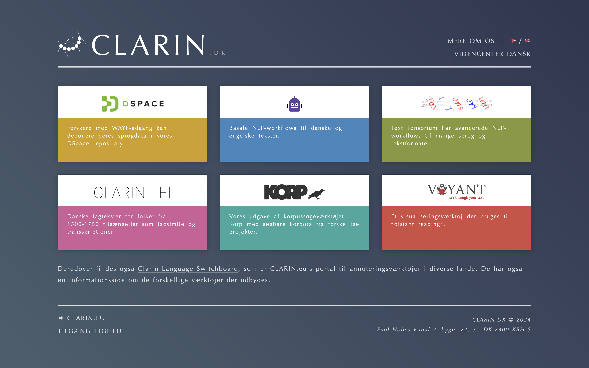

CLARIN landing page
===================


This is a static website used as a landing page for the Danish CLARIN centre.

It is currently installed into the `/data/dkclarin-docs/clarin.dk/` dir on the `dkclarin.dk` server.

## Website updates
Log on to the server using SSH and run the following:

```shell
cd /data/clarin-landing-page
sudo git pull
sudo bash update.sh
```
